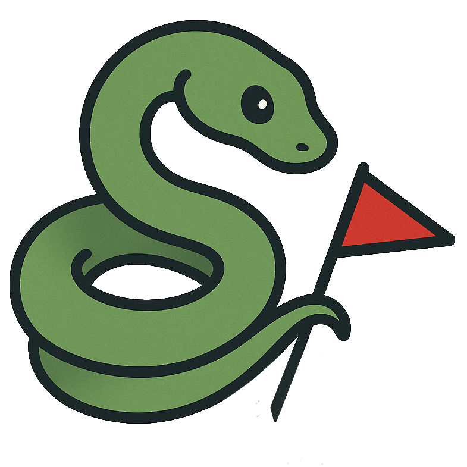
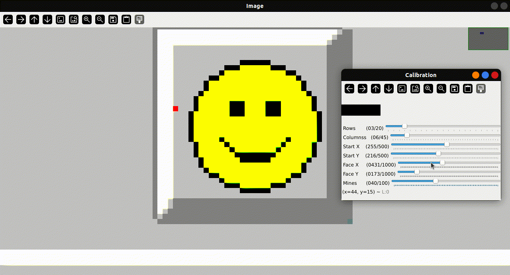
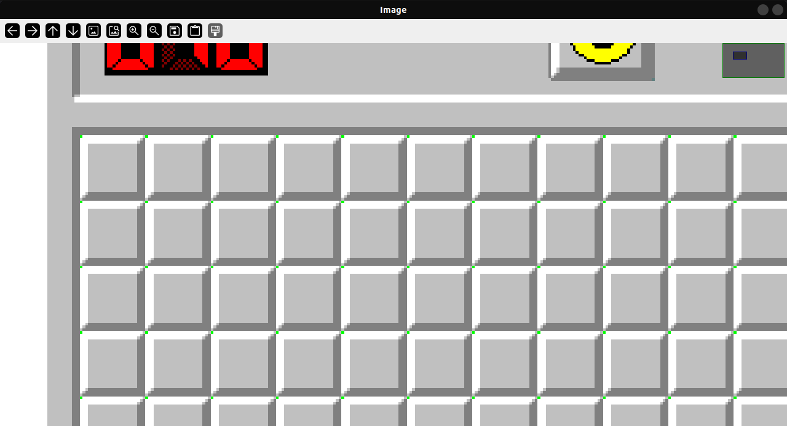
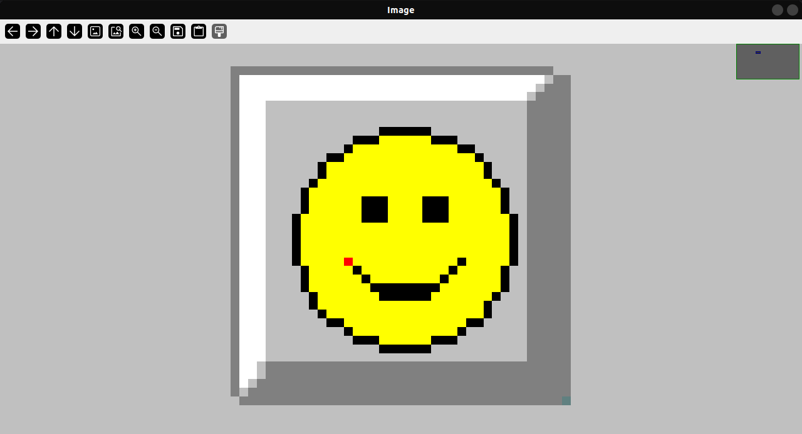

<p align="center" width="100%">

<h1 align="center">PySweeper</h1>
</p>

A python bot that can solve minesweeper.

https://github.com/user-attachments/assets/330cb528-d574-4dcc-bb31-73e76ebf4e02

## Installation

- Clone or download this repository into your system.
```bash
git clone https://github.com/JoelJojoP/PySweeper.git
```
- Install the required libraries using pip.
```bash
pip install -r requirements.txt
```
- For linux users, install the `gnome-screenshot` package using apt.
```bash
sudo apt install gnome-screenshot
```

## Usage

Open the following minesweeper game in a web browser.

Minesweeper Game: [https://minesweeperonline.com/](https://minesweeperonline.com/#150)

> PySweeper is created only for this particular website since it looks into the game screenshot data to extract various information.

> Ensure that the zoom is set to 150%. The zoom control can be found under the 'Display' option.

### Calibration

Before the main program is run, calibration should be performed. The calibration data will be used by the program to locate the grid on the screen.

> Once calibrated for a specific game, recalibration is not necessary if the game settings and the browser are kept the same.

- Run the calibration script.
```bash
python3 calibrate.py
```
- Follow the on-screen instructions.
- The script will take a screenshot and display the screenshot along with another window containing some sliders.
    - Use the 'Rows' and 'Columns' sliders to set the number of rows and columns.
    
    - Use the 'Start X' and 'Start Y' sliders to align the green pixels to the top-left corner of the tiles.
    
    - Use the 'Face X' and 'Face Y' sliders to align the red pixel to the end of the smile on the face icon.
    
    - Use the 'Mines' slider to set the number of mines in the game.
- Once calibration is done, press the `s` key to save the calibration data and exit the program. To exit without saving press the `q` key.

Ensure that the pixels are aligned properly to the minesweeper grid. Here are some images for reference:

*The green pixels are placed at the top-left corner of each tiles.*


*The red pixel is placed at the end of the smile of the face icon.*

### Running PySweeper

- Run the main program
```bash
python3 pysweeper.py
```
- Follow the on-screen instructions.
- Sit back and watch PySweeper solve the game.

To enable logs use the `-v` flag.
```bash
python3 pysweeper.py -v
```

## Limitation

PySweeper uses a combination of minesweeper logic and probabilistic approach to solve the game. There is no guarantee that the program will solve every single game. In case the program fails in a game it will reset the game automatically. This cycle will be repeated till it wins a game.

## Help, I Lost Control of my Mouse!!

Since, this program uses the mouse to interact with the game, the user won't be able to gain control of the mouse till the program ends.

To gain control of the mouse (which will also end the program), rapidly move the mouse to any corner of the screen.

## Licence

This project is licensed under the [MIT Licence](LICENSE).
